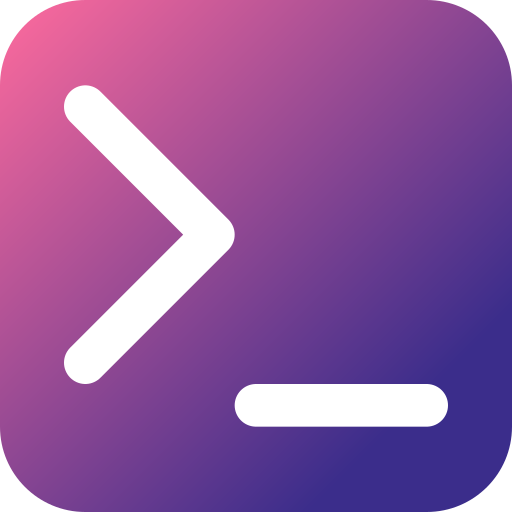
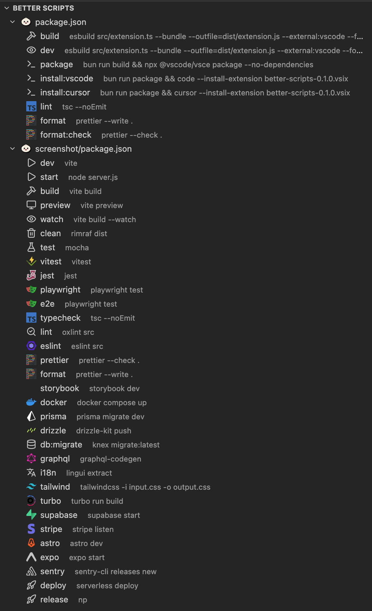
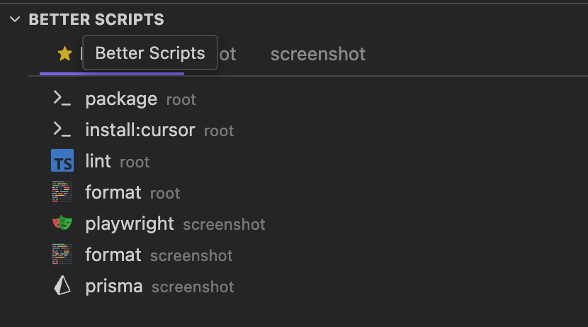

# Better Scripts

A VS Code extension that replaces the built-in npm scripts sidebar with a richer, more capable alternative.

## Features

- **Auto-detects your package manager** -- supports npm, pnpm, bun, and yarn out of the box. Detection is based on lockfiles (`bun.lockb`, `pnpm-lock.yaml`, `yarn.lock`, `package-lock.json`) and the `packageManager` field in `package.json`.
- **One-click run** -- click any script to immediately run it in an integrated terminal.
- **Debug mode** -- hover over a script to reveal a debug button that launches the script with Node.js debugging attached.
- **Go to definition** -- hover to reveal a button that jumps directly to the script in its `package.json`.
- **Contextual icons** -- each script gets an icon based on what it does: test, build, lint, format, Docker, Prisma, Playwright, i18n, deploy, TypeScript, Storybook, and more. Falls back to your package manager's icon.
- **Multi-root support** -- automatically discovers and groups scripts from every `package.json` in your workspace (excluding `node_modules`).
- **Live updates** -- the tree refreshes automatically when any `package.json` changes.
- **Favourites** -- star frequently used scripts to pin them in a dedicated Favourites tab for quick access.
- **Two view modes** -- choose between a classic **list** view or a **tabs** view that lets you switch between individual `package.json` files. Set via `betterScripts.viewMode`.

### Tabs View with Favourites

## Package Manager Detection

The extension checks for lockfiles in this order:

1. `bun.lockb` / `bun.lock` → **bun**
2. `pnpm-lock.yaml` → **pnpm**
3. `yarn.lock` → **yarn**
4. `package-lock.json` → **npm**
5. `packageManager` field in root `package.json` → corresponding manager
6. Fallback → **npm**

## Contributing

Everyone is welcome to open a PR to add more icons or improve existing ones!

## License

MIT
